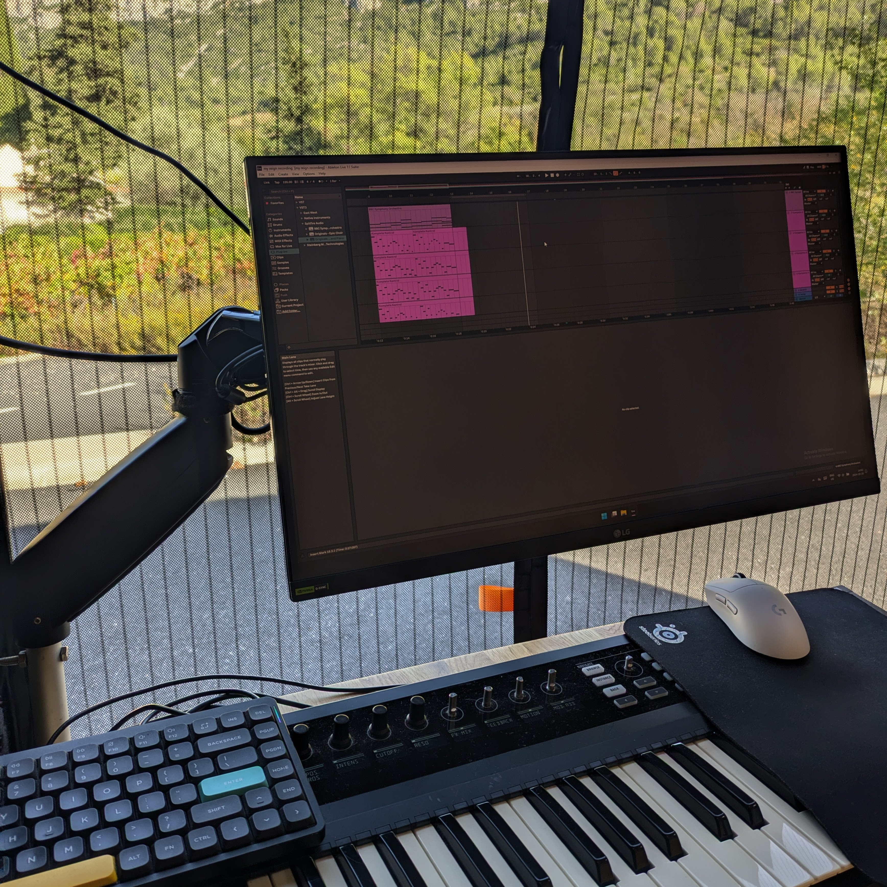

I write piano music while traveling in my van.
My pieces are inspired by nature and the beautiful souls I meet along the way.
I started writing music when I played in the symphonic metal band Rainborn.
To this day, my compositions carry a lot of emotions and often feature tragic melodies.
