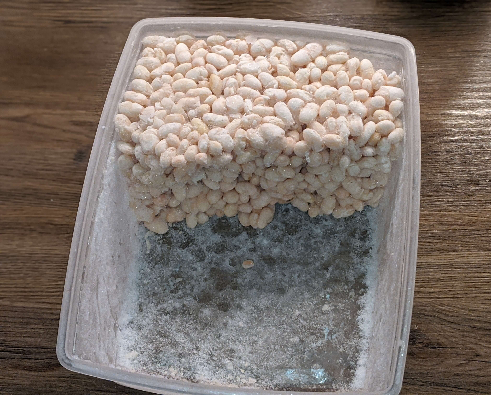
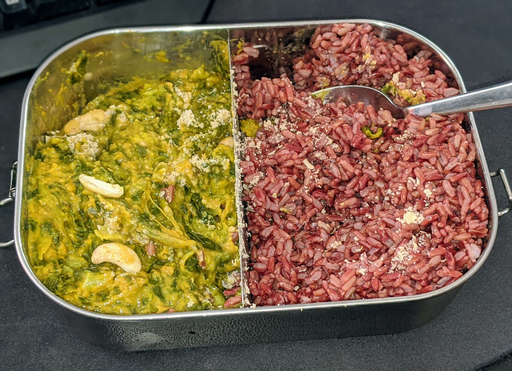
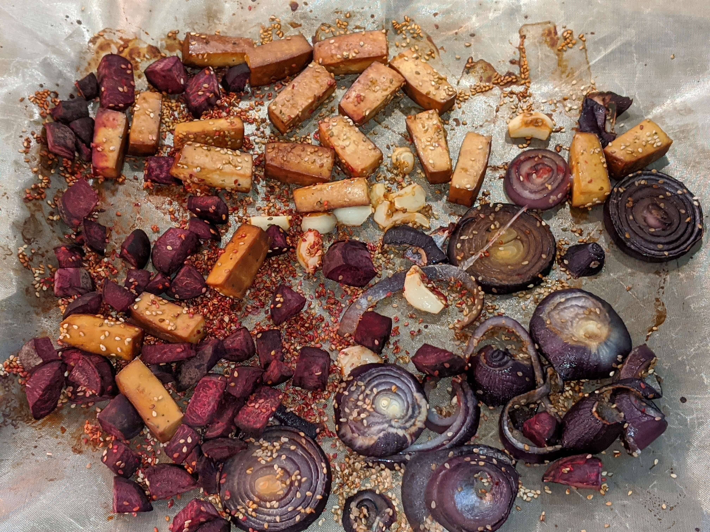
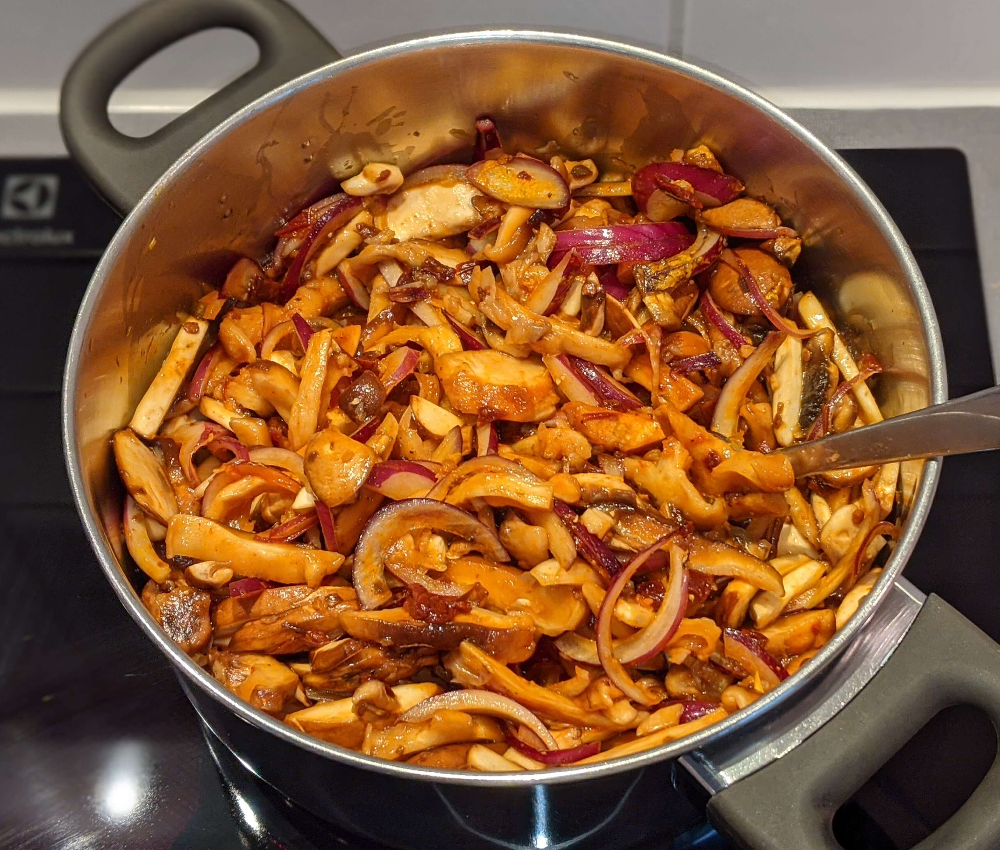
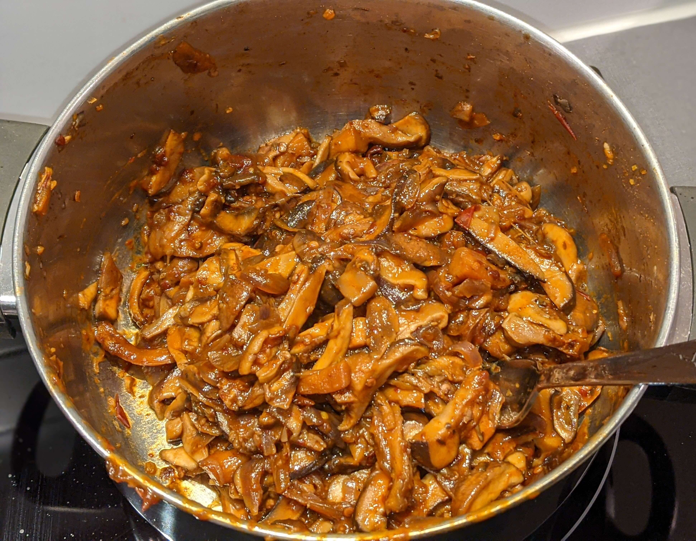
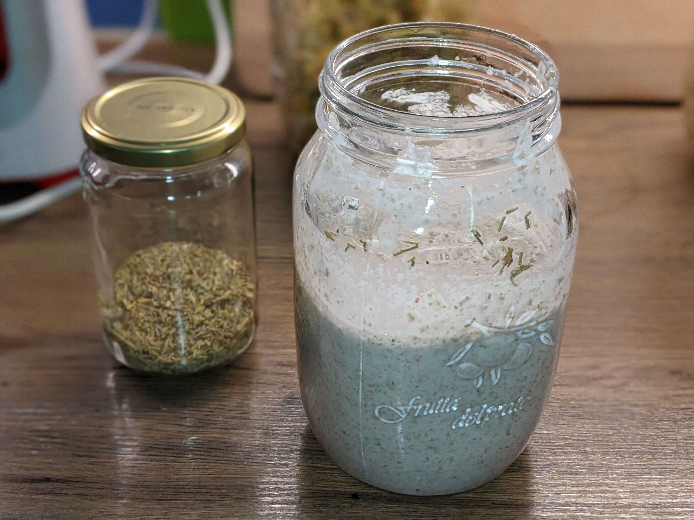
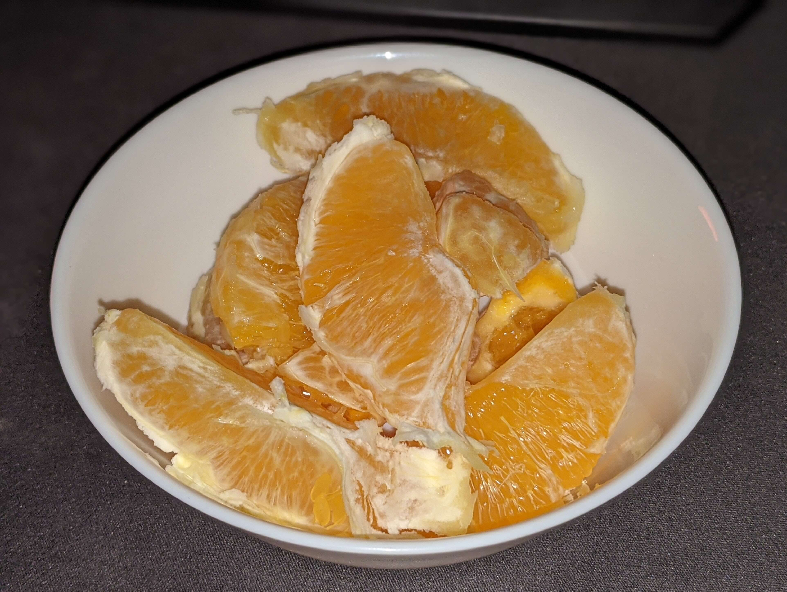
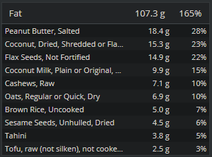

My diet is a very important topic for me and as such I am willing to experiment a lot with it and throw everything,
I thought I knew, overboard, if I learn something new.
From time to time I like to review my diet on whatever factors I recently altered.

Unless you are an Olympic athlete and want to get the last bit of performance out of your diet,
or have a serious medical condition, I don't think there is a point in doing this all the time.
However, doing it when trying out new stuff, can give you a good understanding what foods contain
which nutrients and you can use that on a day to day basis without thinking much about it.

#### What is new, what am I trying to change right now?
The main subjects under review for this week are affordability and the amount of processed/packaged foods that I consume.
I recently started cutting down on packaged foods such as Oat drinks, pre-cooked beans and tofu.
As I was quite happy with the diet in the past month I am simply interested in what amount of money I have to spend on,
what I consider, a healthy and tasty diet, without growing my own vegetables or having to compromise on non-organic food.

I am also interested in checking up on the nutrients as I have not done this in quite a while.

#### About this post

The idea of making this review public is to share my day to day experience with my diet in great detail, as I receive questions on
inspiration on a regular basis and feel that most *What I eat in a day* content on social media only shows the glorious parts or
is simply not detailed enough.

I will not put any additional effort or research into what I am eating during this week.
This, I hope, will give you an idea and some inspiration, what is achievable with very little effort.
I will not use any special kitchen utensils, the most exotic thing, being a blender, to make the results reproducible
for virtually anyone.

(I will try to put slightly more effort into making the food look appealing in the photos though.)

I will provide some insight on the daily food choices that I make in the logbook but as a start here is a concise overview.

#### What labels do I assign my diet?

This list is by no means *final* but at the time of writing this:
* My diet is plant based
* I try to eat as many *whole foods*/*unprocessed foods* as possible
* I avoid gluten if possible
* I don't consume alcohol (apart from my vitamin B12 drops)
* I avoid caffeine
* I avoid salt if possible
* I avoid oil
* I try to not eat too much fat

If you are interested in some more inspiration on similar diets I can highly recommend:
* Dr. Greger's Book [HOW NOT TO DIE](https://nutritionfacts.org/book/how-not-to-die/) as well as
[NutritionalFacts.org](https://nutritionfacts.org/) in general
* Simnett Nutrition's [YouTube Channel](https://www.youtube.com/channel/UCpyhJZhJQWKDdJCR07jPY-Q)
* Mic the Vegan's [YouTube Channel](https://www.youtube.com/channel/UCGJq0eQZoFSwgcqgxIE9MHw)
* The Vegan Corner [YouTube Channel](https://www.youtube.com/user/thevegancorner)

### Review process

For every day, I will log:
* Time of waking up
* Time of going to bed
* Starting time of every food preparation
* Starting time of every meal
* Photo of every meal
* The first time I prepare a meal I will provide some more information on why I am eating this and how I am preparing it
* Amount of every ingredient used (except spices)
* Price per 100g in Euro and SEK of every ingredient in Gothenburg/Sweden

I am using [this scale](https://www.amazon.de/gp/product/B017NZNKYW/ref=ppx_yo_dt_b_asin_title_o02_s00?ie=UTF8&psc=1),
which is not super accurate when it comes to differences of single grams.
So I will weigh my spice glasses once at the start of the week and once at the end,
to get a weekly estimation of the price, I will NOT log the grams of spices per meal in cronometer.

I will have to weigh a lot of foods twice, as, for a banana for example, I want to track the calories of the part that ate,
but the price of the banana including its peel.

Once the week is over I will to track everything, as good as possible, in cronometer, to track macro and micro nutrients.

## Disclaimer

As of writing this, I am working in the home office.
So there won't be as much meal prep going on, as it might have been half a year ago.
However, considering the situation in the world right now, it's probably not as relevant as it used to be either.

I usually exercise quite a lot and burn between 3000 and 4000 kcal a day.
The portion sizes will seem unreasonable at times, but I know what I am about.
One of the great advantages I see, in following a whole food plant based diet, is, that it is really difficult
to overeat, since you will simply be full.

I am not a great cook and don't have a lot of recipes to share.
I think of all the ingredients I would like to eat and then assemble a dish of them.
For that I try to understand, through a lot of experiments, how certain ingredients will behave while cooking
and how to use that to my advantage.
To get started, [the vegan corner YouTube channel](https://www.youtube.com/user/thevegancorner) is an excellent
starting point.
It will give you some great ideas and recipes and explain how to use which ingredients in vegan whole food recipes.
This has worked fine for me in the past years.
I always like my food, since when it's prepared with only delicious ingredients, why shouldn't the end result 
be delicious as well? :)

I am neither a medical or nutritional expert.
What I document here is simply my experience and the decisions I make for me personally.
Please take this as an inspiration and consult someone qualified before undertaking drastic diet changes.

## Logbook

### Supplements

In the morning with the first glass of water I will consume a few supplements.

##### Vitamin B12
I am using these [Vitamin B12 drops](https://www.amazon.de/gp/product/B07K1D8M1N/ref=ppx_yo_dt_b_asin_title_o07_s00?ie=UTF8&psc=1).
I take 5 drops per day, providing me with 1000mcg of Vitamin B12.
One bottle contains 1700 drops and lasts for 340 days.
The drops that I currently use still have an alcohol base, unlike the ones listed on amazon at the time of writing this.
Vitamin B12 is very important but not expensive.
When choosing your supplement, I'd suggest to go for the bio active forms **Methylcobalamin** or **Adenosylcobalamin**.

Price: **0.07 EUR/0.70 SEK** per day.

##### Vitamin D3+K12
I am using these [Vitamin D3+K2 drops](https://www.amazon.de/gp/product/B07BK9F7WB/ref=ppx_yo_dt_b_asin_title_o07_s00?ie=UTF8&psc=1).
I take 5 per day providing me with 125mcg of Vitamin D3 and 100mcg of Vitamin K2.
One bottle contains 1700 drops and lasts for 340 days.

Price: **0.06 EUR/0.67 SEK** per day.

##### Iodine
I am using these [Iodine capsules](https://www.apotea.se/helhetshalsa-eko-jod-100-kapslar).
I take one capsule per day, providing me with 150mcg of Iodine.
One tub contains 100 capsules and will last for 100 days.

I have tried putting dulse in my smoothies before but find that a tea spoon of that is capable of ruining the taste of a 1 liter smoothie.
I did this for over a year and got used to it but never started to really like it.
The capsules are much more convenient.

Price: **0.15 EUR/1.55 SEK** per day.

### Spices

|Spice|Start weight in g|End weight in g|Delta in g|EUR|SEK|
|---|---|---|---|---|---|
|Cinnamon|189|179|10|0.57|6|
|Nutritional Yeast|591|489|102|2.83|29.56|
|Chili|288|282|6|0.36|3.75|
|Coriander|296|289|7|0.11|1.12|
|Ginger|286|276|10|0.34|3.56|
|Turmeric|305|297|8|0.27|2.85|
|Smoked Paprika|377|353|24|0.62|6.5|
|Basil|216|213|3|0.08|0.85|
|Rosemary|209|204|5|0.14|1.41|
|||||||
|Total|||175|5.32|55.6|

### Monday 21.09.2020

|Time|Consumed in g|Dish/Ingredient|Bought in g|EUR|SEK|
|---|---|---|---|---|---|
|7:30||Coconut Oil|12|0.18|1.92|
|||||||
|7:50|961|Lemon Water||0.67|6.98|
||20|Lemon Juice|Half a Lemon|0.53|5.48|
|||Pukka Peppermint & Licorice|One Bag|0.14|1.5|
|||||||
|9:40|918|Oat Meal||2.8|29.18|
||114|Oats|114|0.26|2.73|
||53|Flax Seeds|53|0.27|2.78|
||21|Coconut Flakes|21|0.14|1.47|
||7|Cocoa Powder|7|0.1|1.06|
||113|Frozen Wild Blueberries|113|1.16|12.18|
||149|Banana|230|0.58|5.96|
||31|Peanut Butter|31|0.29|3|
|||||||
|13:28|63|Snack||0.72|7.53|
||47|Raisins|47|0.29|3|
||16|Walnuts|16|0.43|4.53|
|||||||
|13:50|1293|Lunch||3.59|37.33|
||142|Frozen Broccoli|142|0.45|4.7|
||150|Frozen Spinach|150|0.71|7.32|
||167|Red Thai Rice|167|1.34|14.01|
||50|Red Lentils|50|0.29|3|
||133|Coconut Milk|133|0.41|4.31|
||2|Vegetable Bullion|2|0.04|0.38|
||26|Red Onion|33|0.15|1.52|
||4|Garlic|7|0.09|0.94|
||8|Potato Starch|8|0.02|0.19|
||16|Sesame Seeds|16|0.09|0.96|
|||||||
|13:50|350|Water||||
|16:43|350|Water||||
|||||||
|20:17|60|Corn Cakes|60|0.83|8.75|
|||||||
|20:17|350|Water||||
|22:23|350|Water||||
|||||||
|Total|4695|||8.79|91.69|

#### 7:30 Coconut Oil

I got up at 7:30.
The first thing, when I get out of bed, is always to clean my tongue and pull some coconut
oil through my teeth.
I spit the oil out but thought since it's a food and I am tracking all kinds of stuff anyways,
might as well add it here :)

#### 7:50 Lemon water

The first thing I usually have in the morning is some lemon water.
Some times I just drink the lemon juice with water, sometimes I mix it with some herbal infusion.
This is also the time I take my supplements, so I don't forget them.

#### 9:40 Breakfast

My go-to breakfast at the moment is oat meal.
I have experimented with numerous other carbohydrate sources over the years,
rice flakes, rice dosas, spelt flakes, corn flakes, cooked buckwheat, sprouted buckwheat, buckwheat tortillas
cooked oats, overnight oats, ...
For a while now I am settled on oats.
They are easiest to use, taste amazing and I am able to digest them well.

Sprouting legumes and other seeds is a great way to get something fresh into your diet without
having to invest in, in my option, pointless iceberg lettuce or something similar.
It takes a bit of planning, as you will need to know a few days in advance, what you want to eat.
However, if you end up not eating them, they can be stored in the fridge for a few days and stop
growing.
On Sunday evening I soaked 30g of green lentils, 30g of sweet lupines, 20g of chickpeas
(all dry weights).
They will all take about 3 days, until they have my preferred size.
Since the experiment I switched to soaking the legumes during the day.
This gives them 12 more hours before I eat them and they will be even tastier.
How long sprouts will take to grow, depends a lot on the temperature in your kitchen or wherever you store them.

If you are interested in sprouting your own beans, it's super easy to get started.
All you need are some big jars and some nets.
I cannot emphasize enough how much of a waste of money it is to buy sprouting kits!
Just buy mason jars and the lids.
Even if you later decide sprouting is not for you, they can be of great use in the kitchen.

I use [these lids](https://www.amazon.de/gp/product/B07B3Q336D/ref=ppx_yo_dt_b_asin_title_o04_s00?ie=UTF8&psc=1)
and [these glasses](https://www.bormiolirocco.com/en/product/700/jar-50-3-4-oz-quattro-stagioni) in 1l and 1.5l sizes.

#### 13:28 Snack

I started preparing lunch and needed to eat something in between.
I like to snack on dried fruits and nuts.

#### 13:50 Lunch

Even while working from home I usually cook one meal that I can have for lunch three days in a row to save some time in the kitchen.
This week this meal is a rice dish (eating lots of rice is a recurring theme in my diet :)) with some vegetables in a coconut milk sauce.
In the disclaimer I mentioned that I am a basic cook and this dish is the best proof for it.
Start by getting the rice to a boil and in the meantime throw all the other ingredients
(except for the starch) into another pot, and cook until the lentils are soft.
As spices I added: turmeric, coriander, ginger, chili, smoked paprika and cinnamon.

Once the lentils are ready, I wait for it to cool down a slight bit, mix the starch with a hint of
water and then add it to the pot while stirring.
This will thicken the sauce a bit (or a lot, if you add too much).
It's important to not add it into a boiling liquid or it will harden immediately and you will
obtain a lumpy sauce.

I topped the portion that I ate directly off with some sesame seeds and nutritional yeast and
will likely do the same when I take the other portions out of the fridge.

The portions are not exactly equally large which is due to that I'd rather prepare a bit too much
sauce than too little, because dry food is the work of the devil.
Everything that does not fit into the lunch boxes has to be eaten on the same day.

#### 20:17 Soaking some beans

Snacking on some corn cakes, while doing the dishes and soaking some legumes and sunflower seeds.
Rice and corn cakes fulfill two purposes in my kitchen.
Firstly, they are a great, quick and gluten free alternative to bread.

A few go-to toppings are:

* Peanut butter, cinnamon and bananas or dates
* Peanut butter, pickles and mustard
* Bean spread, onions and pickles
* Some condiment, tofu, onions, pickles

... I really like pickles but they can be replaced with Sauerkraut of Koch as well.

Apart from that, rice and corn cakes are a nice, be it more bland, chips like snack which you
can even take with you if you are going for a long walk.
You can be sure that I will have a pack of them in my backpack any time I go out and am uncertain
how long it is to the next meal or if the food will be good. (Just make sure that you have enough
water with you :desert:)

I simply wash the legumes and seeds in the glass before filling the entire container with water
and leaving it to soak for 12 hours.
Soaking times depend on what you want to sprout but 12 hours is long enough for most plants.
In the galas there are 41g of green lentils, 40g of sweet lupines, 21g of red lentils
and 20g of sunflower seeds (all dry weights).

#### 22:23 Going to bed

I try to avoid drinking water the last hour before going to bed and then will have one Glass
immediately before lying down.
Like that I avoid having to get up to go to the bathroom at night and don't wake up completely
dehydrated.

### Tuesday 22.09.2020

|Time|Consumed in g|Dish/Ingredient|Bought in g|EUR|SEK|
|---|---|---|---|---|---|
|7:13||Coconut Oil|14|0.21|2.24|
|||||||
|7:40|973|Lemon Water||0.67|6.98|
||19|Lemon Juice|Half a Lemon|0.53|5.48|
|||Pukka Peppermint & Licorice|One bag|0.14|1.5|
|||||||
|10:27|803|Oat Meal||2.41|25.1|
||104|Oats|104|0.24|2.49|
||32|Flax Seeds|32|0.16|1.68|
||17|Coconut Flakes|17|0.11|1.19|
||6|Cocoa Powder|6|0.09|0.91|
||94|Frozen Wild Blueberries|94|0.97|10.13|
||140|Banana|209|0.52|5.41|
||34|Peanut Butter|34|0.32|3.29|
|||||||
|12:37|1146|Lunch||3.55|36.85|
||142|Frozen Broccoli|142|0.45|4.7|
||150|Frozen Spinach|150|0.71|7.32|
||167|Red Thai Rice|167|1.34|14.01|
||50|Red Lentils|50|0.29|3|
||133|Coconut Milk|133|0.41|4.31|
||2|Vegetable Bullion|2|0.04|0.38|
||26|Red Onion|33|0.15|1.52|
||4|Garlic|7|0.09|0.94|
||8|Potato Starch|8|0.02|0.19|
||8|Sesame Seeds|8|0.05|0.48|
|||||||
|12:37|350|Water||||
|||||||
|15:30|794|Isotonic Drink||1.29|13.5|
||42|Enervit Isotonic Drink|42|1.29|13.5|
||750|Water|||||
|||||||
|16:57|730|Water||||
|||||||
|17:30|25|Corn cakes|25|0.35|3.65|
|||||||
|18:10|2232|Dinner||7.29|76.33|
||632|Potatoes|743|1.41|14.49|
||328|Leek|362|2.06|21.72|
||180|Beetroot|197|1.01|10.62|
||13|Garlic|16|0.21|2.16|
||390|Canned Tomatoes|390|0.94|9.95|
||5|Vegetable Bullion|5|0.09|0.96|
||117|White Beans|85|0.81|8.49|
||40|Pumpkin seeds|40|0.73|7.6|
||4|Bicarbonate|4|0.03|0.34|
|||||||
|19:53|350|Water||||
|23:52|350|Water||||
|||||||
|Total|7753|||15.77|164.65|

#### 7:13 Coconut Oil

I go t up at 7:13

#### 7:40 Lemon Juice

Lemon water same as on Monday :)

I also rinsed the legumes I soaked on Monday and Sunday evening.

#### 10:27 Breakfast

Same as yesterday, slightly less oats because slightly less hungry.
(And I put the coconut flakes on top because I find it looks more appealing in the photo :P)

#### 12:37 Lunch

I got my lunch out of the fridge and sprinkled some nutritional yeast and sesame seeds on top.
Most times I don't bother to get it out of the lunch box and heat it up.
I just wait a bit and start eating.

#### 15:30 Isotonic drink

#### 17:18 Dinner preparations

Cut everything, put it into the pot and boil until the potatoes are good but not too soft.
The beet root will be still a bit crunchy.
Eating raw beet root is not for the light-hearted.
I challenge you to try to eat a big beet root raw.
So make sure that you slice them in really small chunks.
Basil, ginger, turmeric, vegetable broth, smoked paprika
Add bicarbonate so that the tomatoes are not too sour.
Roast the pumpkin seeds.
Garnish with pumpkin seeds + nutritional yeast.

I got impatient and ate a few corn cakes :)

#### 18:10, 18:50, 19:53 & 20:27 Dinner

I don't have this big a dish so I'll split it up in 4 portions like this, that I will eat during the evening.

This meal was a bit too much.
The last one felt kind of forced.
Three portions would have been ideal.

#### 23:52 Going to bed

### Wednesday 23.09.2020

|Time|Consumed in g|Dish/Ingredient|Bought in g|EUR|SEK|
|---|---|---|---|---|---|
|7:28||Coconut Oil|14|0.21|2.24|
|||||||
|7:55|979|Lemon Water||0.63|6.48|
||33|Lemon Juice|Half a Lemon|0.53|5.48|
|||Peppermint Tea|One Bag|0.1|1|
|||||||
|9:50|773|Oat Meal||2.56|26.67|
||98|Oats|98|0.23|2.34|
||38|Flax Seeds|38|0.19|1.99|
||16|Coconut Flakes|16|0.11|1.12|
||7|Cocoa Powder|7|0.1|1.06|
||65|Frozen Wild Blueberries|65|0.67|7.01|
||80|Banana|120|0.3|3.11|
||32|Peanut Butter|32|0.3|3.1|
||87|Frozen mango|87|0.66|6.94|
|||||||
|11:40|350|Water||||
|||||||
|13:58|1116|Lunch||4.16|43.24|
||142|Frozen Broccoli|142|0.45|4.7|
||150|Frozen Spinach|150|0.71|7.32|
||167|Red Thai Rice|167|1.34|14.01|
||50|Red Lentils|50|0.29|3|
||133|Coconut Milk|133|0.41|4.31|
||2|Vegetable Bullion|2|0.04|0.38|
||26|Red Onion|33|0.15|1.52|
||4|Garlic|7|0.09|0.94|
||8|Potato Starch|8|0.02|0.19|
||19|Cashews|19|0.66|6.87|
|||||||
|15:50|350|Water||||
|17:46|350|Water||||
|||||||
|17:55|747|Smoothie||2.4|25.1|
||137|Banana|214|0.54|5.54|
||23|Coconut Flakes|23|0.15|1.61|
||161|Frozen Mango|161|1.22|12.85|
||126|Frozen Banana|~197|0.49|5.1|
|||||||
|20:38|244|Sprouts||0.86|9.07|
||20|Chickpea Sprouts|20|0.13|1.4|
||30|Sweet Lupine Sprouts|30|0.29|3.07|
||30|Green Lentil Sprouts|30|0.27|2.82|
||10|Tamari|10|0.17|1.78|
||2|PiriPiri|2|||
|||||||
|20:38|350|Water||||
|||||||
|21:38|50|Corn Cakes|50|0.7|7.29|
|||||||
|23:48|350|Water||||
|||||||
|Total|5659|||11.52|120.09|

#### 7:28 Coconut Oil

#### 7:55 Lemon water

Today with peppermint tea.
Also rinsed the sprouts.

#### 9:50 Breakfast

Not really different from the other days, except that I added some frozen mango instead of a part of the berries and banana.

#### 13:58 Lunch

#### 15:55 - 17:00 Took a nap

#### 17:55 Smoothie

In recent years I have cut down on the amount of bananas I eat.
These days I mainly eat them in my oat meal, on bike rides or in smoothies.
It's good practice to always have a large amount of bananas at your disposal.
You will be able to eat them when they are at their sweetest and if they at some point get too ripe, you can just freeze them
in smaller pieces.
Frozen bananas are excellent for smoothies or nice cream.
Also you can be sure to always have a *banana for size* at hand, if you take a photo of a big spider or something.

Well, making a smoothie is not exactly science.
Put all the stuff in the blender and blend :)
With so much frozen stuff, it's important to put the unfrozen stuff at the bottom and choose the exact right water temperature.

#### 21:38 Sprouts

Also soaked some new sprouts.
50g of green lentils and 50g of sweet lupines (all dry weights).

#### 21:38 Corn Cakes

#### 23:48 Going to bed

### Thursday 24.09.2020

|Time|Consumed in g|Dish/Ingredient|Bought in g|EUR|SEK|
|---|---|---|---|---|---|
|7:43||Coconut Oil|9|0.14|1.44|
|||||||
|8:05|971|Lemon Water||0.67|6.98|
||37|Lemon Juice|Half a Lemon|0.53|5.48|
|||Pukka Peppermint & Licorice|One Bag|0.14|1.5|
|||||||
|10:34|930|Oat Meal||2.78|29.01|
||138|Oats|138|0.32|3.3|
||44|Flax Seeds|44|0.22|2.31|
||21|Coconut Flakes|21|0.14|1.47|
||8|Cocoa Powder|8|0.12|1.21|
||111|Frozen Wild Blueberries|111|1.14|11.97|
||160|Banana|233|0.58|6.04|
||28|Peanut Butter|28|0.26|2.71|
|||||||
|12:28|350|Water||||
|15:33|350|Water||||
|||||||
|15:33|47|Snack||0.53|5.64|
||35|Raisins|35|0.21|2.24|
||12|Walnuts|12|0.32|3.4|
|||||||
|16:23|1946|Lunch||6.01|62.91|
||300|Whole Grain Rice Pasta|300|2.19|22.95|
||6|Miso paste|6|0.14|1.48|
||10|Tamari|10|0.17|1.78|
||115|Smoked Tofu|115|1.36|14.25|
||15|Sesame Seeds|15|0.09|0.9|
||105|Leek|110|0.6|6.3|
||10|Garlic|12|0.15|1.62|
||120|White Cabbage|120|0.35|3.6|
||89|Red Onion|100|0.44|4.59|
||87|Beetroot|101|0.52|5.44|
|||||||
|16:23|350|Water||||
|20:55|350|Water||||
|||||||
|20:55|517|Sprouts||2.48|26.01|
||41|Green Lentil Sprouts|41|0.37|3.85|
||40|Sweet Lupine Sprouts|40|0.39|4.1|
||21|Red Lentil Sprouts|21|0.12|1.26|
||20|Sunflower Seeds|20|0.11|1.2|
||82|Ketchup|82|0.28|2.95|
||35|Cashews|35|1.21|12.65|
|||||||
|00:09|350|Water||||
|||||||
|Total|6161|||12.61|131.99|

#### 7:43 Coconut Oil

#### 8:05 Lemon water

Also rinsing the sprouts.

#### 10:34 Breakfast

#### 15:33 Lunch

Spices: nutritional yeast, chili, coriander, ginger

#### 20:55 Sprouts

I just rinsed the sprouts, put some ketchup, nutritional yeast and ground cashew nuts on top.
While ketchup is not exactly a whole food, [the one that I use](https://www.felix.se/products/ketchup-osotad/)
from Felix seems to not include too much crap.

#### 00:09 Going to bed

### Friday 25.09.2020

|Time|Consumed in g|Dish/Ingredient|Bought in g|EUR|SEK|
|---|---|---|---|---|---|
|07:45||Coconut Oil|12|0.18|1.92|
|||||||
|8:10|951|Lemon Water||0.67|6.98|
||41|Lemon Juice|Half a Lemon|0.53|5.48|
|||Pukka Peppermint & Licorice|One Bag|0.14|1.5|
|||||||
|10:08|835|Oat Meal||2.59|27|
||102|Oats|102|0.24|2.44|
||32|Flax Seeds|32|0.16|1.68|
||20|Coconut Flakes|20|0.13|1.4|
||7|Cocoa Powder|7|0.1|1.06|
||98|Frozen Wild Blueberries|98|1.01|10.56|
||178|Banana|257|0.64|6.66|
||33|Peanut Butter|33|0.31|3.2|
|||||||
|13:28|350|Water||||
|||||||
|13:38 & 18:32|2133|Lunch||6.01|62.91|
||300|Whole Grain Rice Pasta|300|2.19|22.95|
||6|Miso paste|6|0.14|1.48|
||10|Tamari|10|0.17|1.78|
||115|Smoked Tofu|115|1.36|14.25|
||15|Sesame Seeds|15|0.09|0.9|
||105|Leek|110|0.6|6.3|
||10|Garlic|12|0.15|1.62|
||120|White Cabbage|120|0.35|3.6|
||89|Red Onion|100|0.44|4.59|
||87|Beetroot|101|0.52|5.44|
|||||||
|18:32|350|Water||||
|20:57|350|Water||||
|||||||
|20:57|427|Rice Cakes||2.14|22.26|
||100|Rice Cakes|100|0.8|8.42|
||30|Peanut Butter|30|0.28|2.91|
||297|Banana|422|1.06|10.93|
|||||||
|02:12|350|Water||||
|||||||
|Total|5746|||11.59|121.07|

#### 7:45 Coconut Oil

#### 8:10 Lemon water

Also rinsing

#### 10:08 Breakfast

#### 13:28 Lunch 1/2

#### 18:32 Lunch 2/2

#### 20:57 Dinner

Also cinnamon

Also rinsing and new sprouts

#### 2:12 Going to bed

### Saturday 26.09.2020

|Time|Consumed in g|Dish/Ingredient|Bought in g|EUR|SEK|
|---|---|---|---|---|---|
|10:15||Coconut Oil|12|0.18|1.92|
|||||||
|10:43|400|Lemon Water||0.53|5.48|
||41|Lemon Juice|Half a Lemon|0.53|5.48|
|||||||
|10:43|570|Oat Meal||2|20.92|
||75|Oats|75|0.17|1.79|
||31|Flax Seeds|31|0.16|1.62|
||16|Coconut Flakes|16|0.11|1.12|
||7|Cocoa Powder|7|0.1|1.06|
||79|Frozen Wild Blueberries|79|0.81|8.52|
||30|Peanut Butter|30|0.28|2.91|
||61|Raisins|61|0.37|3.9|
|||||||
|12:43|350|Water||||
|||||||
|13:49|1055|Smoothie||3.34|34.73|
||380|Banana|610|1.53|15.8|
||6|Walnuts|6|0.16|1.7|
||126|Frozen Spinach|126|0.59|6.15|
||20|Coconut Flakes|20|0.13|1.4|
||86|Frozen Wild Blueberries|86|0.89|9.27|
||17|Oats|17|0.04|0.41|
|||||||
|16:30|320|Water||||
|18:30|320|Water||||
|||||||
|18:38|350|Taco filling||9.25|96.91|
||100|Champignon|100|1.57|16.48|
||142|Shiitake mushrooms|150|4.2|43.95|
||52|Oyster mushrooms|75|2.15|22.48|
||40|Chipotle Chilies in Adobo Sauce|40|0.53|5.5|
||84|Red Onion|94|0.41|4.32|
||9|Tamari|9|0.15|1.6|
||10|Garlic|12|0.15|1.62|
||5|Vegetable Bullion|5|0.09|0.96|
|||||||
|18:38|~210|Tortillas||1.15|12.06|
||180|Corn flour|180|1.15|12.06|
|||||||
|18:38|347|Mango Salsa||3.26|34.09|
||250|Frozen Mango|250|1.9|19.95|
||23|Fresh Coriander|Half a plant|0.72|7.5|
||53|Red Onion|58|0.26|2.66|
||15|Lime Juice|Half a Lime|0.38|3.98|
|||||||
|18:38|139|Cashew cream||2.83|29.63|
||60|Cashews|60|2.07|21.68|
||26|Lime Juice|1 Lime|0.76|7.95|
|||||||
|19:21|320|Water||||
|||||||
|19:47|71|Magnum almond|1 Ice Cream|0.95|9.98|
|||||||
|23:00|550|Water||||
|02:11|350|Water||||
|||||||
|Total|5352|||23.49|245.72|

#### 10:15 Coconut Oil

#### 10:43 Lemon water & breakfast

Also rinsing the sprouts.

#### 13:49 Smoothie

#### 16:15 Dinner preparations

I usually follow my adaptation of [this recipe](https://www.theedgyveg.com/2015/04/20/jackfruit-carnitas-pulled-pork-tacos/)
mainly leaving out the oil and making it more spicy.
This time we decided to try out swapping out the jack fruit for mushrooms.
The mushrooms have a better taste but the texture of the jack fruit is better.
Also it was significantly more expensive to use mushrooms as they shrink so much during cooking.

Chop all the ingredients and mix them with a pinch of salt.
It can be difficult to get good fresh mango, especially on short notice.
Frozen mango does the job just fine.

Soak the cashews in water for several hours.
If you are short on time, you can use boiling water and the cashews should be about soft enough
after an hour.
Then simply follow the recipe.
My friend did not have apple cider vinegar, it's also fine without.
I find that 60g of cashews will be fine for 12 tacos (1 can of jack fruit).

If you are eating tacos and are not preparing your own tortillas, you are doing it wrong.
Just get the corn masa (has to be the [nixtamalizado stuff](https://www.naturelo.com.mx/ing/maizazul.php))
and mix it with water, make balls of the dough
(I find 33g to be result the perfect *3 bite taco* size) and then form them by pressing them
in a plastic bag between two flat surfaces (a pot and the kitchen counter will do).

A good mixture of flour and water today was 265ml of water for the 180g of flour and resulted
in 13 tortillas.

Press them quite thin and put them roast them in a preheated pan at medium heat.

#### 18:38 Dinner

#### 19:47 Ice cream

This is my go-to vegan ice cream, that is widely available.
It has been quite some years since I have had the non-vegan version but these days
I cannot imagine that it would taste any better.

#### 23:00

Rinsing the sprouts

#### 2:11 Going to bed

### Sunday 27.09.2020

|Time|Consumed in g|Dish/Ingredient|Bought in g|EUR|SEK|
|---|---|---|---|---|---|
|11:40||Coconut Oil|14|0.21|2.24|
|||||||
|12:10|485|Lemon Water||0.53|5.48|
||44|Lemon Juice|Half a Lemon|0.53|5.48|
|||||||
|12:10|862|Oat Meal||2.45|25.34|
||106|Oats|106|0.24|2.53|
||39|Flax Seeds|39|0.2|2.04|
||16|Coconut Flakes|16|0.11|1.12|
||8|Cocoa Powder|8|0.12|1.21|
||83|Frozen Wild Blueberries|83|0.86|8.95|
||30|Peanut Butter|30|0.28|2.91|
||171|Banana|254|0.64|6.58|
|||||||
|14:25|190|Water||||
|||||||
|14:25|809|Isotonic Drink||1.38|14.46|
||45|Enervit Isotonic Drink|45|1.38|14.46|
||764|Water|||||
|||||||
|15:00|~85|Banana|126|0.32|3.26|
|||||||
|16:10|750|Water||||
|18:00|730|Water||||
|||||||
|18:00|654|Potato Fries||2.46|25.45|
||815|Potatoes|1021|1.94|19.91|
||124|Ketchup|124|0.42|4.46|
||18|Sesame Seeds|18|0.1|1.08|
|||||||
|19:14|1434|Wraps||5.46|57.18|
||204|Buckwheat|204|1.29|13.44|
||273|Carrot|294|1.06|11.14|
||279|Polka beets|313|1.06|11.24|
||183|Red Onion|199|0.88|9.13|
||49|Tahini|49|0.46|4.76|
||40|Mustard|40|0.22|2.32|
||10|Tamari|10|0.17|1.78|
||6|Lemon juice|From Breakfast Lemon|||
||20|Garlic|25|0.32|3.37|
|||||||
|19:14|390|Sprouts||0.94|9.82|
||50|Green Lentil Sprouts|50|0.45|4.7|
||50|Sweet Lupine Sprouts|50|0.49|5.12|
|||||||
|21:40|200|Water||||
|||||||
|22:48|257|Orange|377|1.55|16.21|
|||||||
|00:15|160|Water||||
|||||||
|Total|7006|||15.3|159.44|

#### 11:40 Coconut Oil

Also rinsing the sprouts.

#### 12:10 Breakfast

Also washed and soaked some buckwheat for dinner.

#### 14:25 Cycling snack

#### 16:28 Lunch & Dinner prep

A common misconception is that you need oil for crunchy fries.
If you have parchment paper or a silicone sheet however, you can simply throw potato fries
or wedges on there and put some spices on top.
I used turmeric, smoked paprika, chili and a pinch of salt.
Unfortunately I don't have garlic and onion powder at hand right now.
Those are a real game changer for fries.

Make sure that the fries are evenly spaced and don't overlap too much.
Then you just pop them in the oven at 180C for 50 minutes and turn them around half way through.

Now this recipe blew my mind, when I first found out about it and I ate buckwheat tortillas
every day for several weeks :)
Here is [the first recipe](https://www.youtube.com/watch?v=wuUX_lX-hm4) I followed.
You don't even need a high powered blender.
A stick blender will do the job.
And they are so incredibly versatile.
You can prepare them with varying thickness to achieve, crepes, wraps or pancakes.
You can add all kinds of spices and then have them with peanut butter and banana,
chocolate cream, blueberries, maple syrup or, like I today, as savory wraps.

I added rosemary and garlic.

Make sure that you rinse the buckwheat properly before you mix it with fresh water and blend it.
You can start with less water and then add it until you get the desired consistency.
For 204g of buckwheat my entire mixture today turned out to be 625g.

#### 18:00 Lunch

#### 19:14 Dinner

#### 22:48 Orange snack

Ate an orange because I was craving something cold and fresh after lunch and dinner.
I was too lazy but should have juiced it instead.
Eating a citrus fruit so close before brushing my teeth was not optimal.

Also rinsed the sprouts.

#### 0:15 Going to bed

### Results

## Nutrients

I slightly adjusted the default cronometer settings for my increased calorie intake.
However, I left it on the default settings for micro nutrients.

Here are the result for the week:

### Macro Nutrients

I don't watch how many carbs I consume and am really not concerned about getting enough protein.
My weight is quite steady at 69kg and I am not aiming at becoming Mr. Olympia.
Most of my training is cycling and also there I don't try to build huge muscles.

I try to keep the fat to a reasonable amount, which can get tricky when burning a lot of calories.

Looking at what contributed to the fat over the week, the coconut flakes in the breakfast and smoothies
are quite up there considering how little they do for taste.
I have tried the oat meal without the coconut flakes since looking at the numbers and don't miss it.

### Omega-3 to Omega-6 Ratio

The ratio during this week seems to be about 1:2.
Of course it would be better to get closer to 1:1 but 1:2 is already quite good.

### Vitamin E and Calcium Fix

The week results show an slight deficiency in Vitamin E and Calcium.

Both of them should not be any problem if you are eating processed foods as you will find many foods
fortified with them.

They can be a bit more tricky, if you don't consume processed foods, and don't know what foods contain
significant amounts of them.
This week I at a coconut milk sauce on three days.
A prominent alternative for this would be a sesame sauce, the tahini of which already covers about
a third of the daily need.

A great Vitamin E source is spinach.
A daily portion in your smoothie and you get more than enough.

I plan to swap the peanut butter in my oat meal with almond butter.
Almond butter is a bit more difficult to get in Gothenburg, which is why have been using peanut butter
in the oat meal lately.
From a taste and nutrient perspective however, I think I will be okay with the additional effort
and also price, almond butter is significantly more expensive than peanut butter.

This is how the nutrient result would look with almond butter in the breakfast:

## Cost

|Day|EUR|SEK|
|---|---|---|
|Spices|5.32|55.6|
|Supplements|1.96|20.44|
||||
|Monday|8.79|91.69|
|Tuesday|15.77|164.65|
|Wednesday|11.52|120.09|
|Thursday|12.61|131.99|
|Friday|11.59|121.07|
|Saturday|23.49|245.72|
|Sunday|15.3|159.44|
||||
|Average|15.19|158.67|

Average daily calories: **3625kcal**

The daily costs have a git outlier in saturday.
While I will have days with more expensive meals from time to time, or even dine out,
extreme days like this don't happen with a weekly basis.

A 140 SEK/day diet would cost about 4200SEK per month.

### Conclusions

Having not tracked my food intake in a while I can definitely say that I did not miss it.
Especially documenting everything in here and calculating the cost was no fun :).
This week however, seemed like a good enough representation for my diet in the recent weeks.
So I am at least happy with how that turned out.

It would be good to track time in the kitchen and actual time eating the next time.
However, it would not have made sense to do it during this week since the tracking and taking photos took
quite some time and would have distorted the actual time.
Maybe use something like [jiffy](https://jiffy.nu/) to track it properly.

## New Goals

* I was hoping the cost of my diet would be below 4000SEK but considering the amount of calories,
I consumed during the week, I think it's fine.
I had already planned to source staples of my diet, both from a cost and packaging perspective,
of the internet, where I can buy them in bulk.
I would like to buy spices at [pikantum](https://www.pikantum.de/),
and rice, beans and co. at [RAPUNZEL](https://shop.rapunzel.de/) and [prohviant](https://www.prohviant.de/).

* Swap peanut butter for almond butter in the breakfast.

* Remove coconut flakes from breakfast.

* Test Omega-3 index.

* Sprout the flax seeds instead of consuming them blended in the oat meal.
I consume flax seeds mainly for the Omega-3 and this process is supposed to
increase its availability.

## Price List

I added the name of the store where I bought the food and if there is no link
I will provide the link to an alternative store.
Please notice that the prices and package sizes can differ.
Also ICA online prices seem to be higher than what I pay in the store.

I bought my chili and coriander powder somewhere in India and they are not organic.
So I took the price and the link of the next chili powder that I am going to buy.

|Name|Bought At/Link|Organic|EUR|SEK|Unit|
|---|---|---|---|---|---|
|Ceylon Cinnamon|ICA/[HappyGreen](https://www.happygreen.se/mother-earth-kanel-ceylon-mald-125-g)|✔️|5.73|60|100g|
|Ceylon Ginger|ICA/[HappyGreen](https://www.happygreen.se/mother-earth-ingefara-ceylon-mald-250-g)|✔️|3.4|35.6|100g|
|Turmeric|ICA/[HappyGreen](https://www.happygreen.se/mother-earth-gurkmeja-indien-1-kg-ekologisk)|✔️|3.4|35.6|100g|
|Chili|Don't recall/[pikantum](https://www.pikantum.de/Bio-Chilis-gemahlen-extrem-scharf-250g)|✔️|5.97|62.48|100g|
|Coriander|Don't recall/[pikantum](https://www.pikantum.de/Koriander-gemahlen-250g)|✔️|1.53|16.01|100g|
|Smoked Paprika|[amazon](https://www.amazon.de/gp/product/B00S9U843I/ref=ppx_od_dt_b_asin_title_s00?ie=UTF8&psc=1)|❌|2.59|27.1|100g|
|Basil|[amazon](https://www.amazon.de/gp/product/B073WY64G8/ref=ppx_yo_dt_b_asin_title_o01_s00?ie=UTF8&psc=1)|✔️|2.7|28.25|100g|
|Rosemary|[amazon](https://www.amazon.de/gp/product/B073WWT8WG/ref=ppx_yo_dt_b_asin_title_o01_s00?ie=UTF8&psc=1)|✔️|2.7|28.25|100g|
|Nutritional Yeast|ICA|❌|2.77|28.98|100g|
|Lemon|[ICA](https://www.ica.se/handla/sok/citron/produkt/citron-ekologisk-ca-100g-klass-1-ica-i-love-eco-id_p_2098318200000724/?s=ica-kvantum-frolunda-id_03553)|✔️|1.05|10.95|1 fruit|
|Sesame Seeds|ICA|✔️|0.57|5.99|100g|
|Smoked Tofu|ICA|✔️|1.18|12.39|100g|
|Potatoes|ICA|✔️|0.19|1.95|100g|
|Sunflower Seeds|ICA|✔️|0.57|5.99|100g|
|Banana|[ICA](https://www.ica.se/handla/sok/banan/produkt/banan-ca-765g-ica-i-love-eco-id_p_2098401100000214/?s=ica-kvantum-frolunda-id_03553)|✔️|0.25|2.59|100g|
|Orange|[ICA](https://www.ica.se/handla/sok/banan/produkt/apelsin-ica-ca-310g-id_p_2092317400000724/?s=ica-kvantum-frolunda-id_03553)|✔️|0.41|4.3|100g|
|Frozen Wild Blueberries|[ICA](https://www.ica.se/handla/sok/fryst%20bl/produkt/blabar-fryst-250g-krav-ica-i-love-eco-id_p_7318690125037/?s=ica-kvantum-frolunda-id_03553)|✔️|1.03|10.78|100g|
|Frozen Broccoli|[ICA](https://www.ica.se/handla/sok/broccoli/produkt/broccoli-ekologisk-800-g-ica-id_p_7318690131007/?s=ica-kvantum-frolunda-id_03553)|✔️|0.32|3.31|100g|
|Chioggia beet|ICA|✔️|0.34|3.59|100g|
|Carrots|[ICA](https://www.ica.se/handla/sok/mor/produkt/morotter-500g-krav--ica-i-love-eco-id_p_7318690131960/?s=ica-kvantum-frolunda-id_03553)|✔️|0.36|3.79|100g|
|Frozen Spinach|ICA|✔️|0.47|4.88|100g|
|Peanut Butter|[ICA](https://www.ica.se/handla/sok/jordn/produkt/peanut-butter-creamy-340g-krav-green-choice-id_p_5701038033224/?s=ica-kvantum-frolunda-id_03553)|✔️|0.93|9.69|100g|
|Flax Seeds|[ICA](https://www.ica.se/handla/sok/jordn/produkt/linfron-400g-krav-salta-kvarn-id_p_7317731522002/?s=ica-kvantum-frolunda-id_03553)|✔️|0.5|5.24|100g|
|Coconut Flakes|[ICA](https://www.ica.se/handla/sok/riven%20kokos/produkt/kokos-riven-ekologisk-200g-ica-i-love-eco-id_p_7318690129820/?s=ica-kvantum-frolunda-id_03553)|✔️|0.67|6.98|100g|
|Mustard|[ICA](https://www.ica.se/handla/sok/kung%20buljong/produkt/senap-sotstark-ekologisk-500g-johnnys-id_p_7392031000108/?s=ica-kvantum-frolunda-id_03553)|✔️|0.55|5.79|100g|
|Ketchup|[ICA](https://www.ica.se/handla/sok/kung%20buljong/produkt/ketchup-osotad-970g-felix-id_p_7310240060058/?s=ica-kvantum-frolunda-id_03553)|❌|0.34|3.6|100g|
|Vegetable Bullion|[ICA](https://www.ica.se/handla/sok/kung%20buljong/produkt/gronsaksbuljong-pulver-ekologisk-130g-kung-markatta-id_p_7391835916332/?s=ica-kvantum-frolunda-id_03553)|✔️|1.83|19.19|100g|
|Whole Grain Rice Pasta|[ICA](https://www.ica.se/handla/sok/glutenfri%20pasta/produkt/linguini-pasta-300g-krav-semper-id_p_7310100605412/?s=ica-kvantum-frolunda-id_03553)|✔️|0.73|7.65|100g|
|Raisins|[ICA](https://www.ica.se/handla/sok/russin/produkt/soltorkade-russin-500g-krav-salta-kvarn-id_p_7317731501205/?s=ica-kvantum-frolunda-id_03553)|✔️|0.61|6.39|100g|
|Frozen Mango|[ICA](https://www.ica.se/handla/sok/mango/produkt/mango-fryst-ekologisk-250g-ica-i-love-eco-id_p_7318690141754/?s=ica-kvantum-frolunda-id_03553)|✔️|0.76|7.98|100g|
|Red Thai Rice|ICA|✔️|0.8|8.39|100g|
|Tahini|ICA/[Urtekram](https://www.urtekram.se/mat/notsmor-och-palagg/tahini/)|✔️|0.93|9.7|100g|
|Tamari|ICA|✔️|1.7|17.8|100g|
|Rice Cakes|[ICA](https://www.ica.se/handla/sok/riskakor/produkt/riskakor-lattsaltade-ekologisk-130g-friggs-id_p_7310186055606/?s=ica-kvantum-frolunda-id_03553)|✔️|0.8|8.42|100g|
|Corn Cakes|[ICA](https://www.ica.se/handla/sok/riskakor/produkt/tunna-riskakor-majs-ekologisk-130g-friggs-id_p_7350028544738/?s=ica-kvantum-frolunda-id_03553)|✔️|1.39|14.58|100g|
|Red Onion|ICA|✔️|0.44|4.59|100g|
|Garlic|[ICA](https://www.ica.se/handla/sok/vitl/produkt/vitlok-ekologisk-200g-klass-1-ica-i-love-eco-id_p_7318693307652/?s=ica-kvantum-frolunda-id_03553)|✔️|1.29|13.48|100g|
|Walnuts|ICA|✔️|2.7|28.29|100g|
|Cashews|ICA|✔️|3.45|36.13|100g|
|Beetroot|ICA|✔️|0.51|5.39|100g|
|Corn Masa|ICA/[andale](https://www.andale.se/en/product/gluten-and-gmo-free-blue-cornflour-for-tortillas-naturelo-1kg)|❌|0.64|6.7|100g|
|Enervit Isotonic Drink|[apotea]()|❌|3.07|32.14|100g|
|Magnum Almond|[Willy:s](https://www.willys.se/produkt/Almond-Vegan-Glass-101282646_ST)|❌|0.95|9.98|1|
|Oats|ICA|✔️|0.23|2.39|100g|
|Pukka Peppermint&Licorice Tea|[ICA](https://www.ica.se/handla/sok/pukka/produkt/peppermint---licorice-te-ekologisk-20-p-pukka-id_p_5060229011107/?s=ica-kvantum-frolunda-id_03553)|✔️|0.14|1.5|1 bag|
|Peppermint Tea|[Willy:s](https://www.willys.se/produkt/ortte-Pepparmynta-101132141_ST)|❌|0.1|1|1 bag|
|Lime|ICA|✔️|0.76|7.95|1 fruit|
|Fresh Coriander|ICA|✔️|1.43|15|1 plant|
|Buckwheat|[ICA](https://www.ica.se/handla/sok/bovete/produkt/bovete-500g-krav-salta-kvarn-id_p_7317731520008/?s=ica-kvantum-frolunda-id_03553)|✔️|0.63|6.59|100g|Probably wrong price because online price
|Chipotle Chilies in Adobo Sauce|[Willy:s](https://www.willys.se/produkt/Chipotle-i-Adobosas-101210363_ST)|❌|1.32|13.76|100g|
|Pumpkin Seeds|ICA/[HappyGreen](https://www.happygreen.se/kung-markatta-pumpafron-500g-ekologisk)|✔️|1.82|19|100g|Probably wrong price because online price
|Leek|ICA|✔️|0.57|6|100g|
|Sweet Lupines|[Spiegelhauer](https://www.baeckerei-spiegelhauer.de/Bio-Lupinensamen-1-kg-von-der-weissen-Suesslupine)|✔️|0.98 dry|10.24 dry|100g|
|Green Lentils|ICA|✔️|0.9 dry|9.39 dry|100g|
|Red Lentils|[ICA](https://www.ica.se/handla/sok/linser/produkt/roda-linser-500g-krav-salta-kvarn-id_p_7317731511006/?s=ica-kvantum-frolunda-id_03553)|✔️|0.57 dry|5.99 dry|100g|Probably wrong price because online price
|Chickpeas|ICA|✔️|0.67 dry|6.99 dry|100g|
|White Beans|ICA|✔️|0.95 dry|9.99 dry|100g|
|Cocoa Powder|[ICA](https://www.ica.se/handla/sok/kakao/produkt/kakao-ekologisk-125g--ica-i-love-eco-id_p_7318690007869/?s=ica-kvantum-frolunda-id_03553)|✔️|1.45|15.16|100g|
|Coconut Oil|ICA|✔️|1.53|15.99|100g|
|Coconut Milk|ICA|✔️|0.31|3.24|100g|
|Potato Starch|[ICA](https://www.ica.se/handla/sok/potatis%20st%C3%A4rkelse/produkt/potatismjol-500g-lyckeby-starkelse-id_p_7310160000158/?s=ica-kvantum-frolunda-id_03553)|❌|0.23|2.39|100g|Probably wrong price because online price
|Canned Tomatoes|ICA|✔️|0.24|2.55|100g|100g|
|Bicarbonate|[ICA](https://www.ica.se/handla/sok/potatis%20st%C3%A4rkelse/produkt/bikarbonat-200g-dr-oetker-id_p_5701073061039/?s=ica-kvantum-frolunda-id_03553)|❌|0.81|8.48|100g|
|Miso Paste|ICA|✔️|2.36|24.65|100g|
|White Cabbage|ICA|✔️|0.29|3|100g|
|Champignons|ICA|✔️|1.57|16.48|100g|
|Shiitake Mushrooms|ICA|✔️|2.8|29.3|100g|
|Oyster Mushrooms|ICA|✔️|2.86|29.97|100g|

